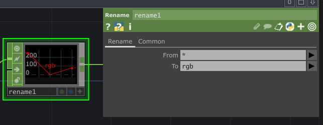
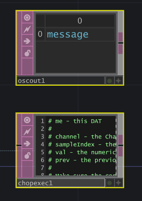
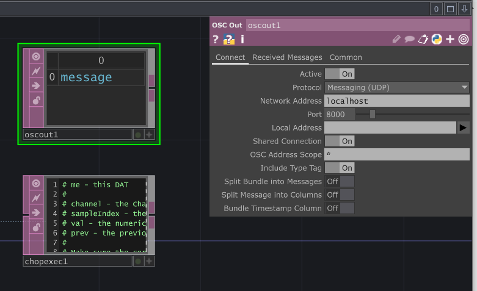
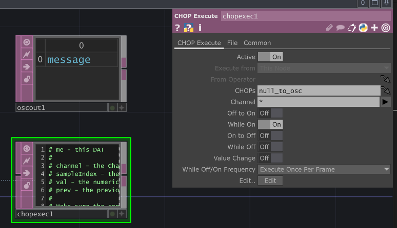

# Contrôle du Pixel par OSC dans TouchDesigner

## Préalable(s)

- [Protocole Open Sound Control (OSC)](osc/protocole.md)
- [Tutoriel: OscBridge, M5 Angle et le bouton](m5stack/atom/tutoriel/angle-button-oscbridge.md)
- [La réception d'OSC avec MicroOsc](osc/microosc-reception.md)

## Code TouchDesigner

### 1) Créer le réseau qui va créer le canal RGB (trois entiers entre 0-255) nommé «rgb»


#### Configurer les OP




### 2) Ajouter le réseau pour la sortie OSC




> [!WARNING]
> Attention! L'OP _OSC Out_ doit absolument s'appeler «oscout1».


#### Configurer les OP





Voici le code qui doit être dans la boîte _Edit_ du «chopexec1»:
```cpp
# me - this DAT
# 
# channel - the Channel object which has changed
# sampleIndex - the index of the changed sample
# val - the numeric value of the changed sample
# prev - the previous sample value
# 
# Make sure the corresponding toggle is enabled in the CHOP Execute DAT.

def onOffToOn(channel, sampleIndex, val, prev):
	return

def whileOn(channel, sampleIndex, val, prev):
	# GET NAME AND VALUES
	oscpath = "/"+channel.name
	values = channel.vals
	
	#CONVERT FLOATS TO INTS
	index = 0
	while index < len(values):
    		values[index] = int(values[index])
    		index = index + 1

	#SEND VALUES OVER OSC
	op('oscout1').sendOSC(oscpath, values)
	return

def onOnToOff(channel, sampleIndex, val, prev):
	return

def whileOff(channel, sampleIndex, val, prev):
	return

def onValueChange(channel, sampleIndex, val, prev):
	return
	
```

### 3) Voici ce à quoi devrait ressembler le réseau complété


## Code Arduino

Partir du code du [Tutoriel: OscBridge, M5 Angle et le bouton](../../m5stack/atom/tutoriel/angle-button-oscbridge.md).

Ajouter le code suivant à _loop()_ juste après _M5.update()_ :
```cpp
  // TRIGGER maReceptionMessageOsc() IF AN OSC MESSAGE IS RECEIVED :
  monOsc.onOscMessageReceived(maReceptionMessageOsc);
```

Ajouter la fonction suivante à _l'espace global_ :
```cpp
void maReceptionMessageOsc(MicroOscMessage& oscMessage) {
  // IF THE OSC ADDRESS IS "/pixel"
  if (oscMessage.checkOscAddress("/rgb")) {
    // PARSE THREE int ARGUMENTS
    int red = oscMessage.nextAsInt();
    int green = oscMessage.nextAsInt();
    int blue = oscMessage.nextAsInt();
    // USE THE VALUES TO CREATE A COLOR
    pixel = CRGB(red, green, blue);
    FastLED.show();
  } 
}
```